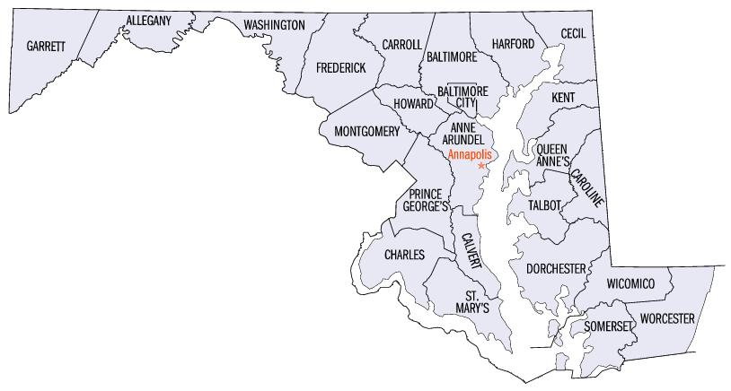

Here is an example analysis using R code.

## Introduction

Education level is often considered a key factor influencing income levels [@tamborini2015education]. Higher educational attainment is generally associated with better job opportunities, higher salaries, and improved economic stability. This example analysis aims to explore the relationship between education levels and income in Maryland counties using publicly available datasets, and use it to demonstrate data manipulation and visualization techniques in R. Here, I will focus on Maryland as an example state, but similar analyses can be conducted for other states or regions.

{width=200px fig-align="center"}
[@MdCountiesMap2025]


## Aims

- To provide an overview of the education levels in Maryland counties over the years.
- To provide a general understanding of the relationship between education levels and median household income in Maryland counties.

## Intended Audience

This analysis is intended for individuals interested in understanding the relationship between education and income. I will try to keep the language simple and avoid technical jargon, making it accessible to a broader general public audience.

## Data Source

As education is commonly linked to income, we will analyze the relationship between these two variables using the data sets from U.S. Department of Agriculture Economic Research Service [@USDA2025a]. The documentation for the datasets can be found [@USDA2025b]. In summary, the education dataset contains information on educational attainment levels for individuals aged 25 and older, while the unemployment dataset contains information on unemployment rates.

## Data Dictionary

There is no comprehensive data dictionary provided for these datasets, but based on the documentation and inspecting the datasets, here are the relevant columns for our analysis.

### Education Dataset
|  |  |
|------------------------------------|------------------------------------|
| FIPS Code | Federal Information Processing Standard code is a unique numeric identifier for geographic areas in the United States, ranging from states to counties and even smaller units like census blocks |
| State | Name of the state |
| Area name | Name of the area, could be state or county. In the structure of "County, stateID" |
| Attribute | Information for the education level and the year of survey was taken |
| Value | Number of person with in this attribute |

### Unemployment and Income Dataset

|  |  |
|------------------------------------|------------------------------------|
| FIPS_Code | Federal Information Processing Standard code is a unique numeric identifier for geographic areas in the United States, ranging from states to counties and even smaller units like census blocks |
| State | Name of the state |
| Area_Name | Name of the area, could be state or county. In the structure of "County, stateID" |
| Attribute | Information for the emplyoment and median household income, and the year of survey was taken |
| Value | Number of the attribute |

::: {.callout-caution}
## Always double-check the name of the columns when merging datasets!
For example, in the education dataset, the FIPS code column is named "FIPS Code", while in the unemployment dataset, it is named "FIPS_Code". This difference in naming conventions can lead to errors when merging datasets if not properly addressed. I will proceed to clean up this later in the analysis.
:::

## Data Analysis

### Step 1. Load required packages and read in the datasets
First load the required packages:
```{r}
#| message: false
library(tidyverse)
library(here)
library(sessioninfo)
library(kableExtra)
```

Next, we need to download the datasets from the USDA website to the working directory, under /data. In order to not repeat the download step, I put in the code to check if the file already exists, and only download if it does not. It the file is already there, it will skip the download step and just read in the existing file.

```{r}
if (!file.exists("data/Education2023.csv")) {
  download.file("https://ers.usda.gov/sites/default/files/_laserfiche/DataFiles/48747/Education2023.csv?v=78660", 
                destfile = "data/Education2023.csv")
}
if (!file.exists("data/Unemployment2023.csv")) {
  download.file("https://ers.usda.gov/sites/default/files/_laserfiche/DataFiles/48747/Unemployment2023.csv?v=44357", 
                destfile = "data/Unemployment2023.csv")
}
```

::: {.callout-note}
## Note on data download
To maintain proper equitte, I try to not re-download the data files if they already exist in the working directory. This helps to avoid unnecessary downloads and pose unneeded load on the data server.
:::

Then read in the datasets:
```{r}
education_data <- read_csv(here("data/Education2023.csv"))
unemployment_data <- read_csv(here("data/Unemployment2023.csv"))
MD.edu <- education_data %>%
  filter(State == "MD")
MD.income <- unemployment_data %>%
  filter(State == "MD")
```

We can take a look at the first few rows of each dataset to understand their structure

```{r}
head(MD.edu)
head(MD.income)
```

## Step 2. Data Wrangling and Merging Datasets
First we can plot relationship between the percentage of individuals with a bachelor's degree or higher and the median household income in Maryland counties, and focusing on the education data from 2019-2023 and the unemployment data from 2022. I clean up the names, removing the "county" suffix for better readability, also seperate the year from the attribute name, both for education and unemployment data. Also, `Attribute_edu` will be "attribute, year", `Attribute_unemp` will be "attribute_year", and I want to slice off the year part for both to put in separate columns "year_edu" and "year_unemp"

```{r}
MD.edu.clean <- MD.edu %>%
  mutate(`Area name` = str_replace(`Area name`, " County", ""),
         Year = str_extract(Attribute, "\\d{4}"),
         Attribute = str_remove(Attribute, ", \\d{4}"))
```

First we visual the change in education level over the years in Maryland counties, focusing on the percentage of adults with a bachelor's degree or higher from 1990 to 2000, faceted by county. Due to there are both raw counts and percentage values in the education data, I will first filter to only keep the percentage values.

```{r}
MD.edu.clean <- MD.edu.clean %>%
  filter(str_detect(Attribute , "Percent"))
```

Then I will check the unique attributes in the education data to see if there are any redundant labels that need to be collapsed.

```{r}
unique(MD.edu.clean$Attribute)
```

::: {.column-margin}
Unfortunately, there are multiple labels that mean the same thing, so I will need to collapse them into a single label for each education level.
:::

```{r}
MD.edu.clean <- MD.edu.clean %>%
  mutate(Attribute = case_when(
    Attribute %in% c("Percent of adults with less than a high school diploma", 
                         "Percent of adults who are not high school graduates",
                         "Percent of adults who are not high school graduates-12",
                         "Percent of adults who are not high school graduates-23") ~ "Less than high school",
    Attribute %in% c("Percent of adults with a high school diploma only", 
                         "Percent of adults who are high school graduates (or equivalent)",
                         "Percent of adults who are high school graduates (or equivalent)-12",
                         "Percent of adults who are high school graduates (or equivalent)-23"
                         ) ~ "High school",
    Attribute %in% c("Percent of adults completing some college (1-3 years)",
    "Percent of adults completing some college or associate degree",
    "Percent of adults completing some college or associate degree-12",
    "Percent of adults completing some college or associate degree-23") ~ "Some college or associate degree",
    Attribute %in% c("Percent of adults completing four years of college or higher",
    "Percent of adults with a bachelor's degree or higher",
                         "Percent of adults with a bachelor's degree or higher-12",
                         "Percent of adults with a bachelor's degree or higher-23") ~ "Bachelor or Higher",
    TRUE ~ Attribute
  ))
```

I can use `piviot_wider()` to reshape the data so that each education level becomes a separate column, making it easier to analyze the distribution of education levels over the years.

```{r}
MD.edu.wide <- MD.edu.clean %>% 
  pivot_wider(names_from = Attribute, values_from = Value)
```

```{r}
kable(MD.edu.wide, caption = "Maryland Educational Level by County, 1970 - 2019") %>%
  kable_styling(full_width = F) %>%
  scroll_box(width = "100%", height = "400px")
```

Now we can focus on the income data. We can first look at the unemployment rates in Maryland counties change in years, faceted by county.
```{r}
MD.income.clean <- MD.income %>%
  mutate(`Area_name` = str_replace(`Area_Name`, " County, MD", ""),
         Year = str_extract(Attribute, "\\d{4}"),
         Attribute = str_remove(Attribute, "_\\d{4}"))

# manually change Baltimore city, MD to Baltimore city
MD.income.clean <- MD.income.clean %>%
  mutate(`Area_name` = ifelse(`Area_name` == "Baltimore city, MD", "Baltimore city", `Area_name`))
MD.employment <- MD.income.clean %>%
  filter(Attribute == "Unemployment_rate")
```

The data is already tidy in the long-format, but since I am interested in combining the education information with employment data, I will need to merge them together using the common column "FIPS", which represents the unique identifier for each geological area. Now we can analyze the relationship between education level and median household income in Maryland counties. We will focus on the education data from 2019 and the income data from 2022.

```{r}
MD.income.edu <- MD.edu.clean %>%
  filter(Year == "2019", Attribute == "Bachelor or Higher") %>%
  select(`Area name`, Percent_bachelor = Value) %>%
  inner_join(MD.income.clean %>%
               filter(Year == "2022", Attribute == "Median_Household_Income") %>%
               select(`Area name` = `Area_name`, Median_Income = Value),
             by = "Area name")
```

::: {.callout-note}
## Note on merging datasets
As mentioned earlier, the Area name columns are different in the two datasets, so I need to specify the column names when merging the datasets using `inner_join()`.
:::

## Step 3. Data Analysis and Visualization

Finally, I can create a stacked bar chart to visualize the change in education levels over the years in Maryland counties, faceted by county. I also want to make sure the order of the education levels in the stacked bar chart is from lowest to highest.

```{r}
# relevel the Attribute factor levels to ensure proper order in the stacked bar chart
MD.edu.clean$Attribute <- factor(MD.edu.clean$Attribute, 
                                 levels = c("Less than high school", 
                                            "High school", 
                                            "Some college or associate degree", 
                                            "Bachelor or Higher"))
ggplot(MD.edu.clean, aes(x = Year, y = Value, fill = Attribute)) +
  geom_bar(stat = "identity") +
  facet_wrap(~ `Area name`) +
  labs(title = "Education Level Distribution in Maryland Counties (1990-2023)",
       x = "Year",
       y = "Percentage of Adults",
       fill = "Education Level",
       caption = "Data From USDA 2025\nData visualization by Lo-Yu Chang") +
  theme_minimal()
```

Overall, we can see a trend of increasing education levels in Maryland counties over the years, with more adults attaining higher education degrees.

Now we can create a line graph to visualize the change in employment status over the years in Maryland counties, faceted by county. 
```{r}
ggplot(MD.employment, aes(x = Year, y = Value, group = 1)) +
  geom_line() +
  geom_point() +
  facet_wrap(~ `Area_name`) + # I want to change year interval to be every 5 years
  scale_x_discrete(breaks = seq(1990, 2022, by = 5)) +
  labs(title = "Unemployment Rate in Maryland Counties (1990-2022)",
       x = "Year",
       y = "Unemployment Rate (%)",
       caption = "Data From USDA 2025\nData visualization by Lo-Yu Chang") +
  theme_minimal()
```

Overall, we can see that the unemployment rates in Maryland counties have fluctuated over the years, with some counties experiencing higher rates than others. The main two peaks in unemployment rates correspond to the Great Recession of 2008-2009 and COVID-19 pandemic in 2020.

Now we can create a scatter plot to visualize the relationship between education level and median household income in Maryland counties, also include a linear regression line to see the trend. 

```{r}
ggplot(MD.income.edu, aes(x = Percent_bachelor, y = Median_Income)) +
  geom_point() +
  geom_text(aes(label = `Area name`), vjust = -0.5, hjust = 0.5, size = 3) +
  geom_smooth(method = "lm", se = FALSE, color = "blue") +
  labs(title = "Relationship between Education Level and Median Household Income in Maryland Counties",
       x = "Percentage of Adults with Bachelor's Degree or Higher (2019)",
       y = "Median Household Income (2022)",
       caption = "Data From USDA 2025\nData visualization by Lo-Yu Chang") + 
  theme_minimal()
```

For more quantitative analysis, we can fit a linear model to see the correlation coefficient between education level and median household income.

```{r}
model <- lm(Median_Income ~ Percent_bachelor, data = MD.income.edu)
summary(model)
```

## Summary

Over the last 40 years, Maryland counties have seen a significant increase in education levels, with more adults attaining higher education degrees. The unemployment rates in Maryland counties have fluctuated over the years, with some counties experiencing higher rates than others, particularly during economic downturns such as the 2008 Great Recession and the COVID-19 pandemic. As for the primary focus of this analysis, we can see from the scatter plot and the linear regression line that there is a positive correlation between the percentage of adults with a bachelor's degree or higher and the median household income in Maryland counties. The linear model summary shows that for every 1% increase in the percentage of adults with a bachelor's degree or higher, the median household income increases by approximately $1,613. This suggests that higher education levels are associated with higher income levels in Maryland counties. However, this is a correlational relationship and does not imply causation. Other factors may also contribute to income levels, and further analysis would be needed to establish causality, also the direction of causality cannot be determined from this analysis alone, ie. whether higher education leads to higher income or vice versa.

## Summary for used functions for TA grading

### `dplyr`
- `filter()`
- `mutate()`
- `select()`
- `inner_join()`
- `case_when()`

### `tidyr`
- `pivot_wider()`

In total **6 functions** from `dplyr` and `tidyr` were used for data manipulation.

### `ggplot2`
- `geom_point()`
- `geom_text()`
- `geom_smooth()`
- `geom_bar()`
- `facet_wrap()`
- `labs()`
- `theme_minimal()`
- `scale_x_discrete()`
- `geom_line()`

In total **9 functions** from `ggplot2` and specifically **5 geom_ functions** were used for data visualization.

## Session Info
```{r}
session_info()
```